# Phase 1: Infrastructure Setup

## Overview

This phase covers deploying Splunk Enterprise, Shuffle, and TheHive on a single Ubuntu server, and preparing all virtual machines in the lab environment.

---

## 1.1 Install Splunk Enterprise
> Performed on: **Ubuntu Server – 10.0.0.8**

### Step 1 – Download Splunk

```bash
wget -O splunk-10.2.3-4d61cf8a5c0c-linux-amd64.deb "https://download.splunk.com/products/splunk/releases/10.2.3/linux/splunk-10.2.3-4d61cf8a5c0c-linux-amd64.deb"
```
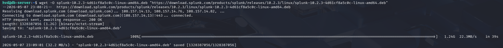

### Step 2 – Install

```bash
sudo dpkg -i splunk-10.2.3-4d61cf8a5c0c-linux-amd64.deb
sudo /opt/splunk/bin/splunk start --accept-license --run-as-root
```
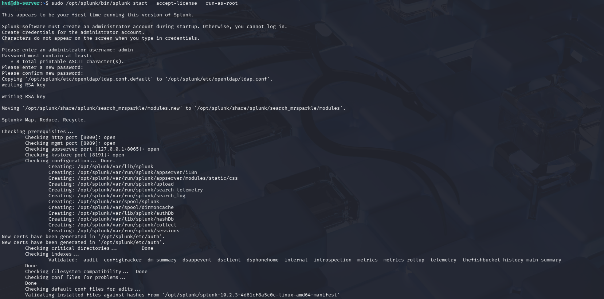
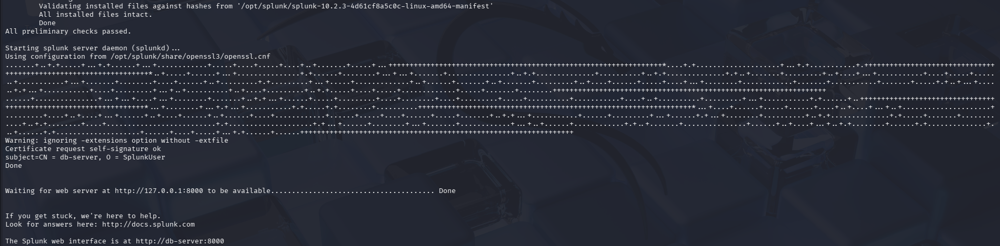

### Step 3 – Enable autostart

```bash
sudo /opt/splunk/bin/splunk enable boot-start --run-as-root

```
### Step 4 – Verify

```bash
sudo /opt/splunk/bin/splunk status
```
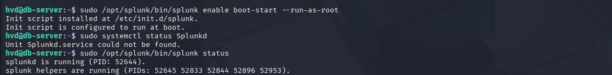

Access dashboard: `http://127.0.0.1:8000`

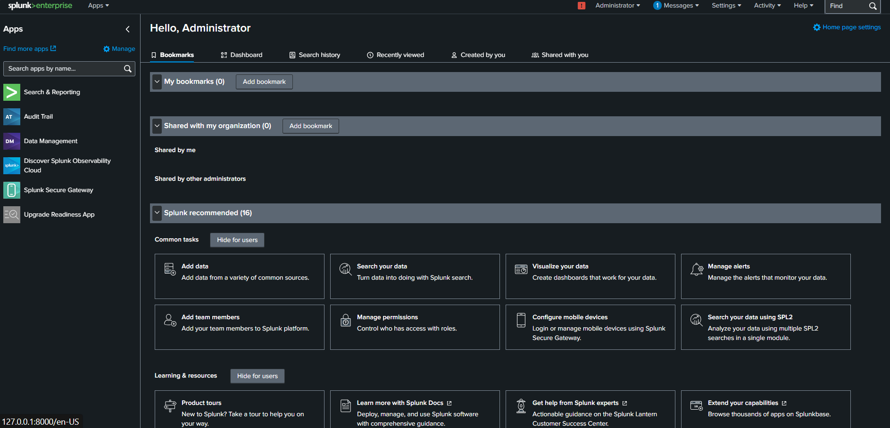

---

## 1.2 Install Docker (for Shuffle + TheHive)

```bash
# Install Docker
sudo apt update
sudo apt install -y docker.io docker-compose
sudo systemctl enable docker
sudo systemctl start docker

# Add user to docker group
sudo usermod -aG docker $USER
newgrp docker
```
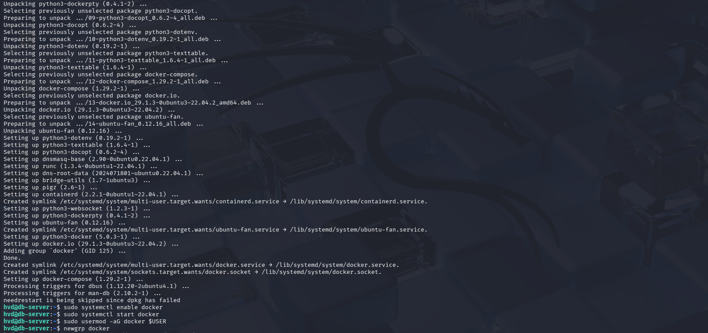
---

## 1.3 Install Shuffle

```bash
# Clone Shuffle repo
git clone https://github.com/Shuffle/Shuffle
cd Shuffle

# Start Shuffle
docker-compose up -d
```
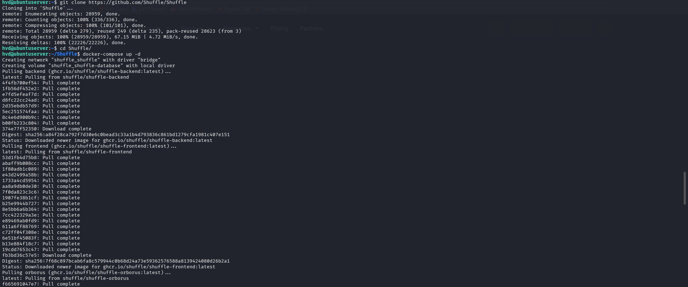

Access Shuffle: `http://10.0.0.8:3001`

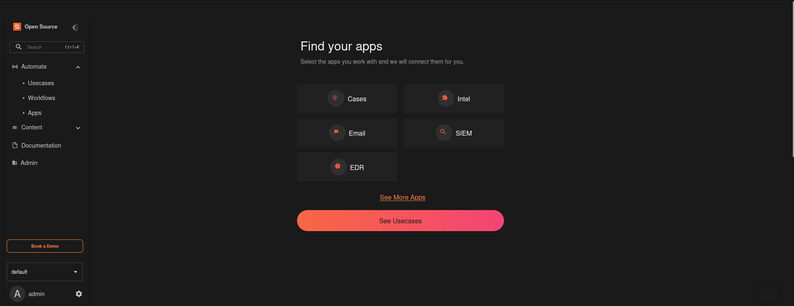

### Verify containers running

```bash
docker ps | grep shuffle
```
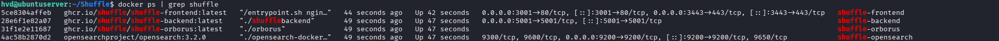

---

## 1.4 Install TheHive 5

```bash
mkdir thehive && cd thehive
```

Create file `docker-compose.yml`:

```yaml
version: "3"
services:
  thehive:
    image: strangebee/thehive:5.2
    ports:
      - "9000:9000"
    environment:
      - JVM_OPTS=-Xms512m -Xmx512m
    volumes:
      - thehive-data:/opt/thp/thehive/db
      - thehive-index:/opt/thp/thehive/index
      - thehive-attachments:/opt/thp/thehive/attachments

volumes:
  thehive-data:
  thehive-index:
  thehive-attachments:
```
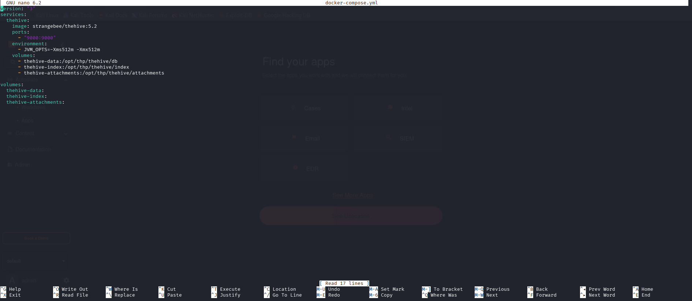

```bash
docker-compose up -d
```

Access TheHive: `http://127.0.0.1:9000`

Default credentials: `admin@thehive.local` / `secret`
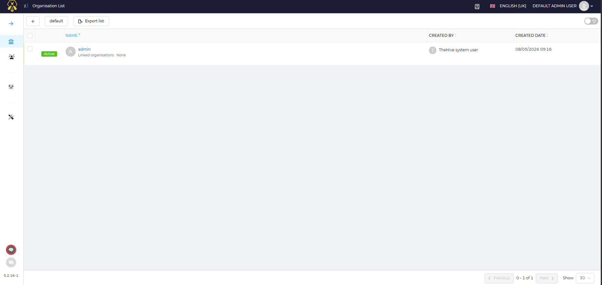

---

## 1.5 Summary – Services & Ports

| Service | Port | URL |
|---|---|---|
| Splunk Web | 8000 | http://127.0.0.1:8000 |
| Splunk HEC | 8088 | http://10.0.0.8:8088 |
| Splunk Receiver | 9997 | tcp://10.0.0.8:9997 |
| Shuffle | 3001 | http://10.0.0.8:3001 |
| TheHive | 9000 | http://127.0.0.1:9000 |
