# Phase 2: Splunk Configuration & Log Ingestion

## Overview

This phase covers installing Splunk Universal Forwarder on endpoints and configuring log collection from Windows (Sysmon + Event Log) and Linux (Syslog + Auditd).

---

## 2.1 Enable Splunk Receiving Port
> Performed on: **SOC Server – 10.0.0.8**

```bash
/opt/splunk/bin/splunk enable listen 9997 -auth admin:At$452012

# Splunk Web UI: Settings → Forwarding and receiving → Configure receiving → Add new → Port 9997
```
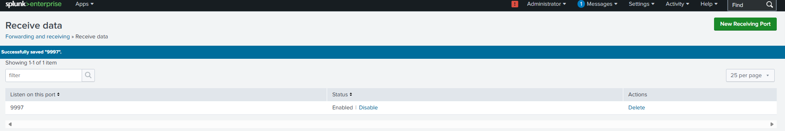

---

## 2.2 Install Splunk Universal Forwarder – Windows Agent
> Performed on: **Windows 10 – 10.0.0.7**

### Step 1 – Download & Install

Download: https://www.splunk.com/en_us/download/universal-forwarder.html

Run installer:
- Receiving Indexer: `10.0.0.8`
- Port: `9997`
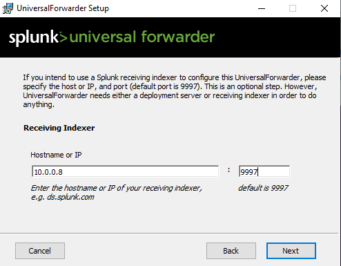

### Step 2 – Install Sysmon

```powershell
# Download Sysmon + config
Invoke-WebRequest -Uri "https://download.sysinternals.com/files/Sysmon.zip" -OutFile "Sysmon.zip"
Expand-Archive Sysmon.zip

# Download SwiftOnSecurity config
Invoke-WebRequest -Uri "https://raw.githubusercontent.com/SwiftOnSecurity/sysmon-config/master/sysmonconfig-export.xml" -OutFile "sysmonconfig.xml"

# Install Sysmon
.\Sysmon64.exe -accepteula -i sysmonconfig.xml
```
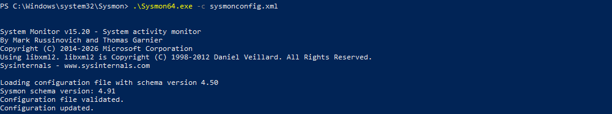

### Step 3 – Configure inputs.conf

File location: `C:\Program Files\SplunkUniversalForwarder\etc\system\local\inputs.conf`

```ini
[WinEventLog://Application]
index = wineventlog
disabled = 0

[WinEventLog://Security]
index = wineventlog
disabled = 0

[WinEventLog://System]
index = wineventlog
disabled = 0

[WinEventLog://Microsoft-Windows-Sysmon/Operational]
index = sysmon
disabled = 0
renderXml = true
```
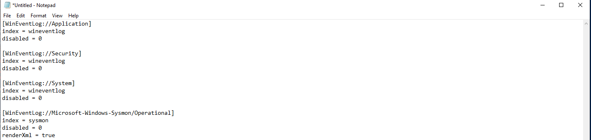

### Step 4 – Restart Forwarder

```powershell
Restart-Service SplunkForwarder
```

---

## 2.3 Install Splunk Universal Forwarder – Linux Agent
> Performed on: **Ubuntu – 10.0.0.4**

### Step 1 – Download & Install

```bash
wget -O splunkforwarder-9.2.1-linux-amd64.deb \
  "https://download.splunk.com/products/universalforwarder/releases/9.2.1/linux/splunkforwarder-9.2.1-linux-amd64.deb"

sudo dpkg -i splunkforwarder-9.2.1-linux-amd64.deb
sudo /opt/splunkforwarder/bin/splunk start --accept-license
```
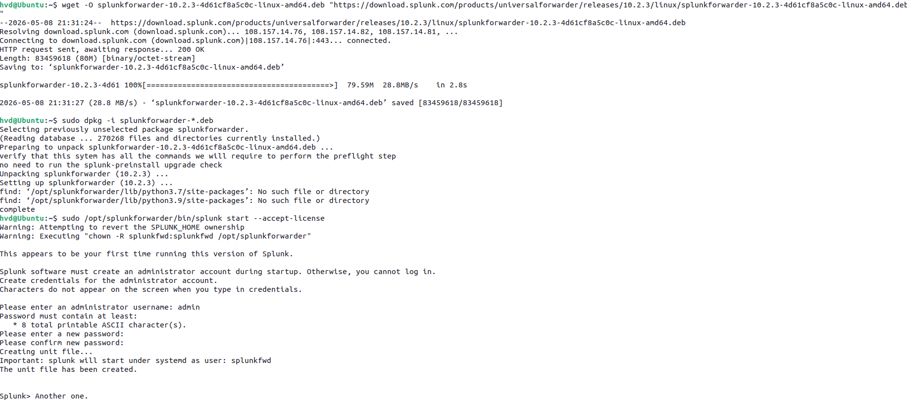

### Step 2 – Configure Auditd

```bash
sudo apt install -y auditd
sudo systemctl enable auditd

# Add audit rules
sudo auditctl -w /etc/passwd -p wa -k passwd_changes
sudo auditctl -w /etc/shadow -p wa -k shadow_changes
sudo auditctl -w /bin/su -p x -k su_execution
```
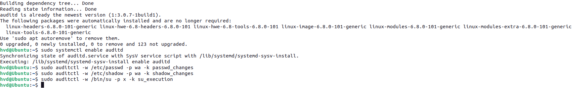

### Step 3 – Configure inputs.conf & outputs.conf

`/opt/splunkforwarder/etc/system/local/inputs.conf`:

```ini
[monitor:///var/log/syslog]
index = linux_logs
sourcetype = syslog

[monitor:///var/log/auth.log]
index = linux_logs
sourcetype = linux_secure

[monitor:///var/log/audit/audit.log]
index = linux_audit
sourcetype = linux_audit
```
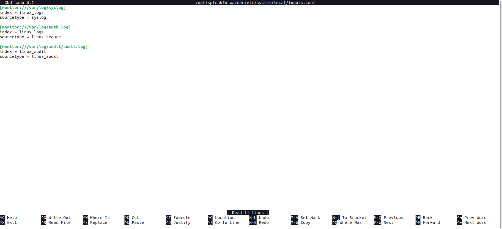

`/opt/splunkforwarder/etc/system/local/outputs.conf`:

```ini
[tcpout]
defaultGroup = splunk_server

[tcpout:splunk_server]
server = 10.0.0.8:9997
```
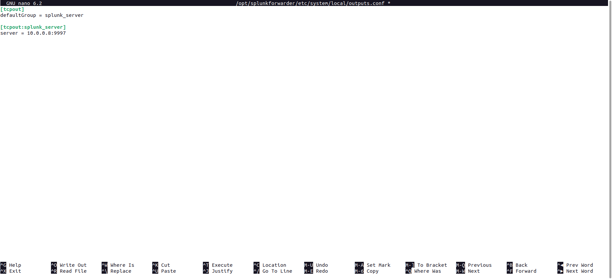

### Step 4 – Restart Forwarder

```bash
sudo /opt/splunkforwarder/bin/splunk restart
```
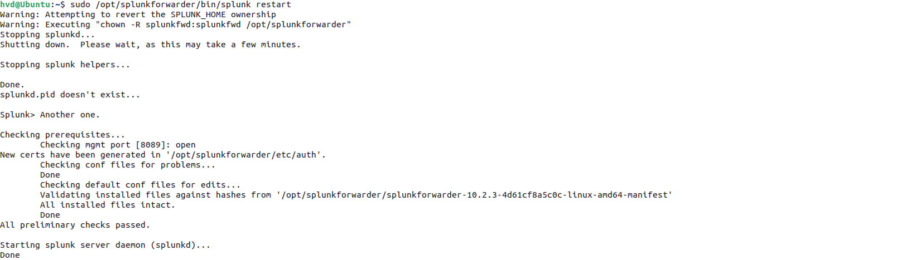

---

## 2.4 Verify Log Ingestion in Splunk

Login Splunk Web `http://127.0.0.1:8000`, run search:

```spl
index=wineventlog | stats count by host
index=sysmon | stats count by host
index=linux_logs | stats count by host
index=linux_audit | stats count by host
```
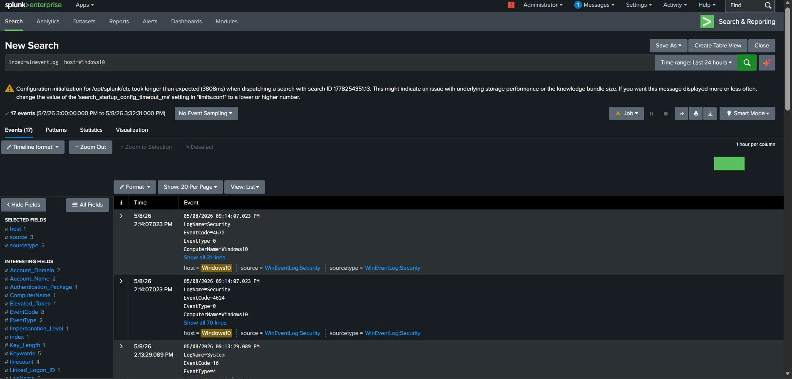
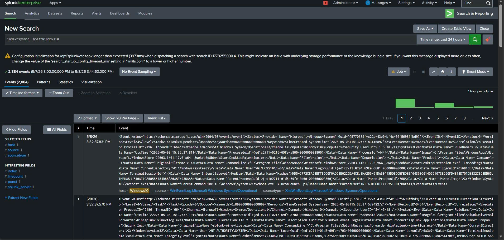
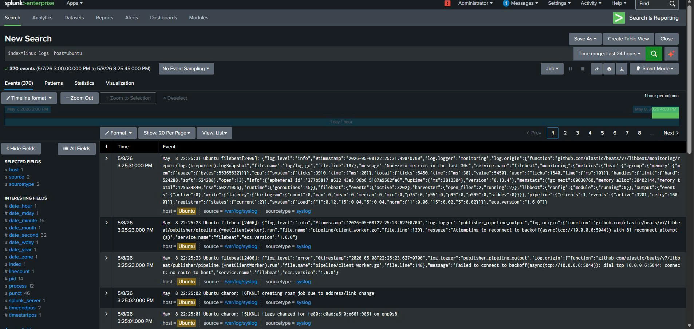
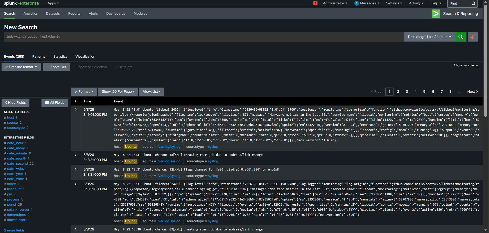

Expect result: can see data from both agents.

---

## 2.5 Create Indexes

Go to **Settings → Indexes → New Index**, create the indexs:

| Index Name | Purpose |
|---|---|
| `wineventlog` | Windows Event Log |
| `sysmon` | Sysmon logs |
| `linux_logs` | Linux syslog + auth |
| `linux_audit` | Linux auditd |
