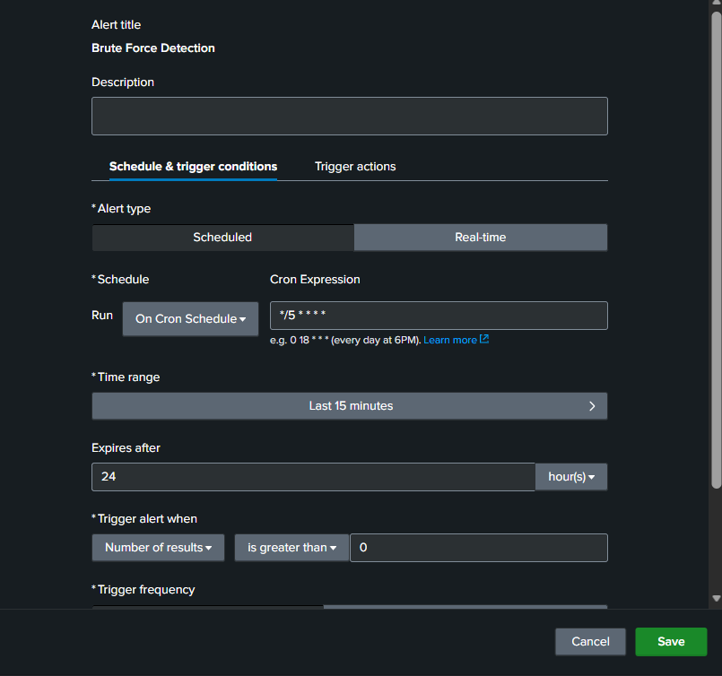
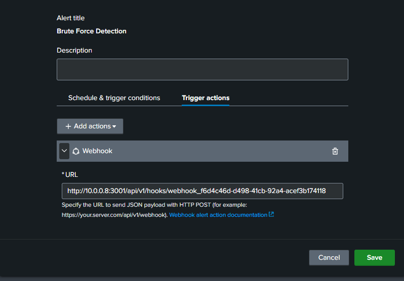
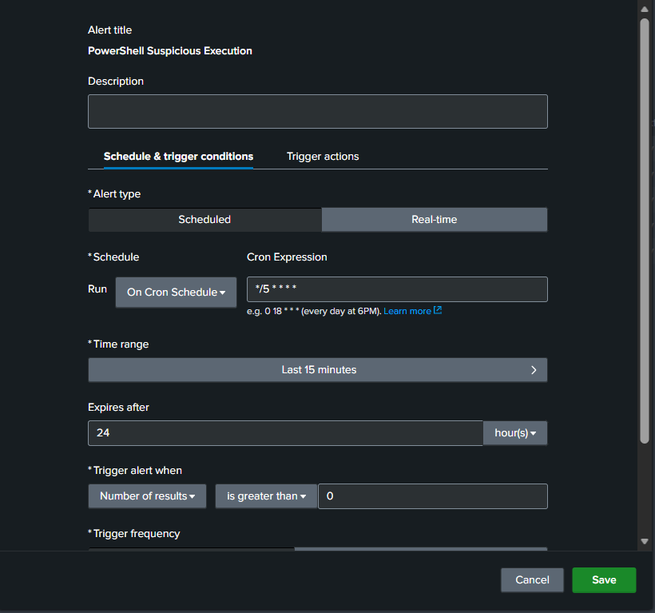
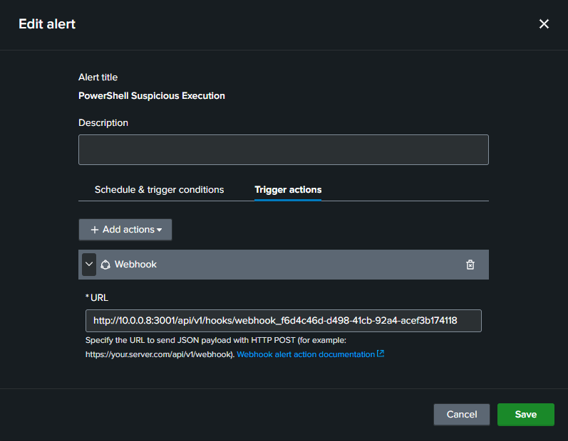
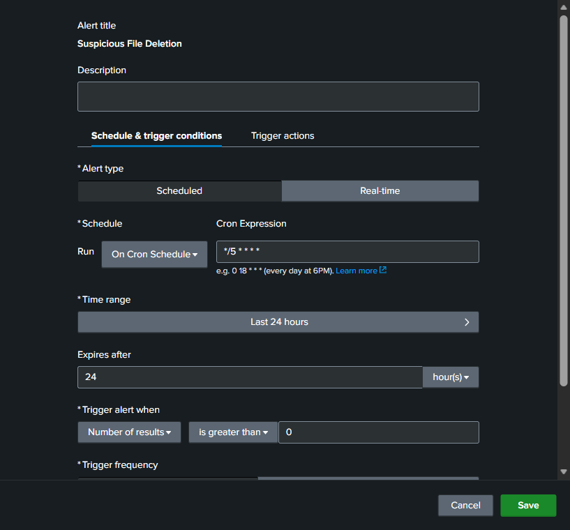
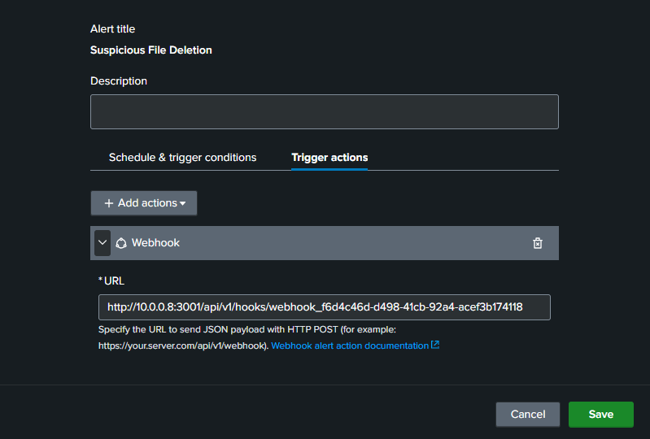
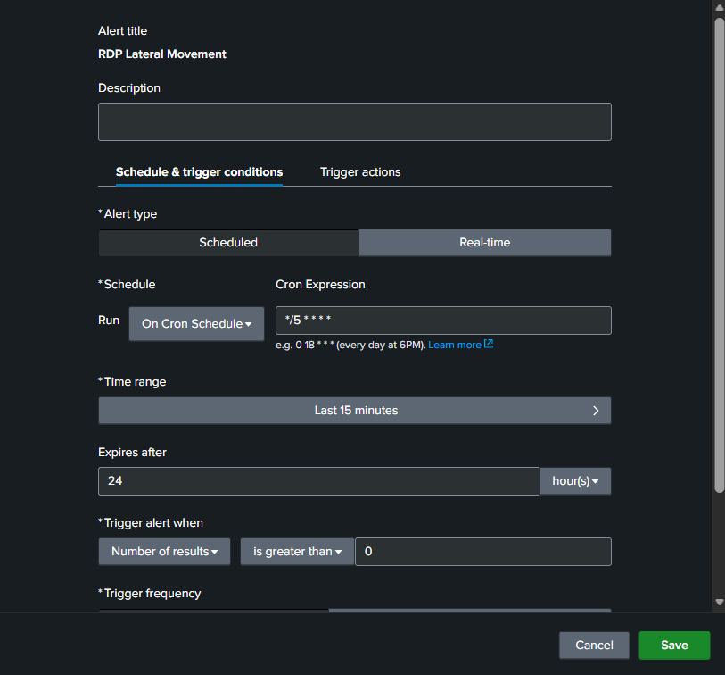
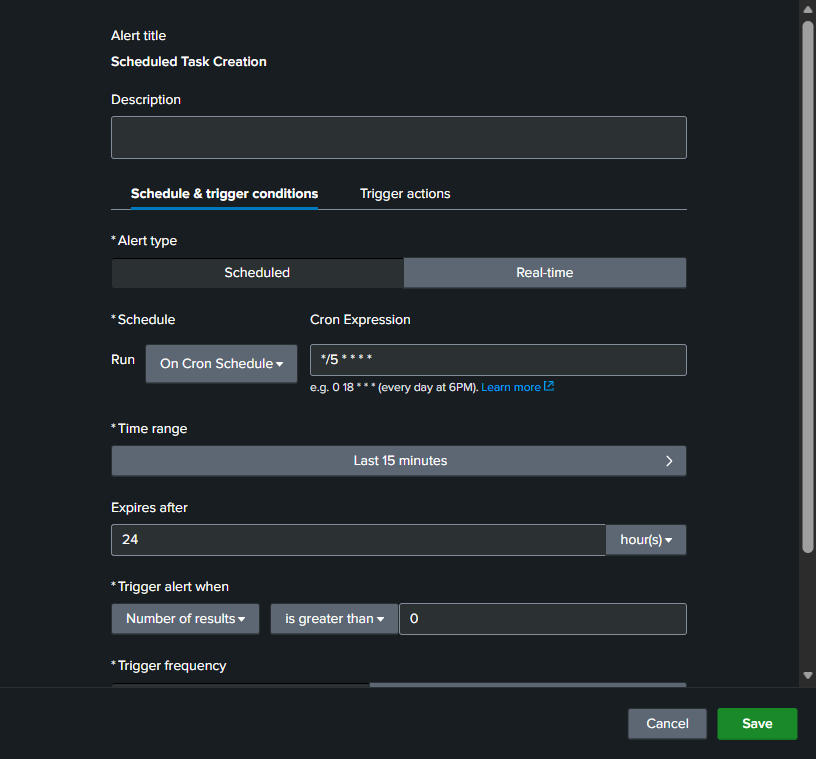
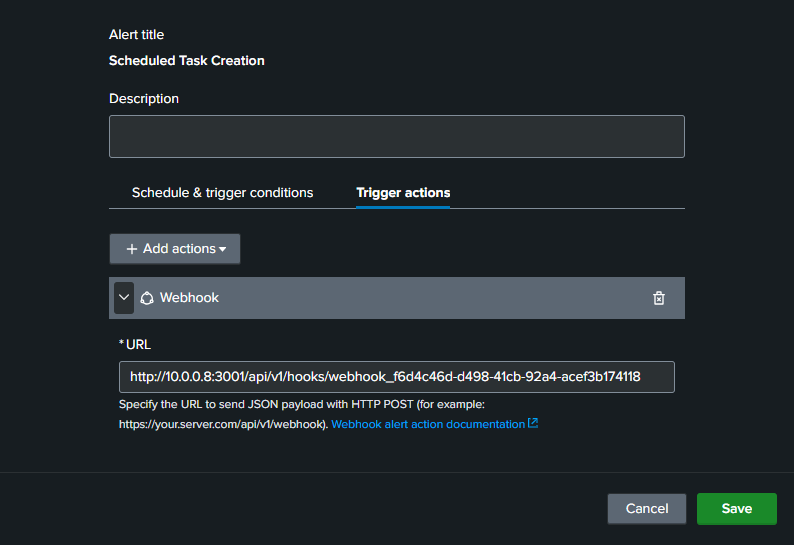

# Phase 3: Detection Alert Rules & Webhook Trigger

## Overview

This phase covers creating detection rules in Splunk mapped to MITRE ATT&CK techniques and configuring a webhook to trigger Shuffle automatically when an alert fires.

---

## 3.2 Configure Webhook to Shuffle

### Step 1 – Tạo Webhook trong Shuffle

1. Shuffle → **Workflows → New Workflow**
2. Add trigger: **Webhook**
3. Copy Webhook URL: `http://10.0.0.8:3001/api/v1/hooks/webhook_f6d4c46d-d498-41cb-92a4-acef3b174118`

### Step 2 – Gán Webhook vào Alert

In each alert → **Trigger Actions → Add Actions → Webhook**:
```
URL: http://10.0.0.8:3001/api/v1/hooks/webhook_f6d4c46d-d498-41cb-92a4-acef3b174118
```

---

## 3.1 Create Alert Rules

**Search & Reporting → Save As → Alert**

### Alert 1 – Brute Force Detection (T1110.001)

**Search:**
```spl
index=wineventlog EventCode=4625
| stats count by src_ip, user, host
| where count > 5
```

**Alert Settings:**
- Run every: `5 minutes`
- Trigger when: `Number of results > 0`
- Trigger Actions: `Webhook`
- Webhook URL: `http://10.0.0.8:3001/api/v1/hooks/webhook_f6d4c46d-d498-41cb-92a4-acef3b174118`




---

### Alert 2 – PowerShell Execution (T1059.001)

```spl
index=sysmon EventCode=1
| search CommandLine="*powershell*" AND (CommandLine="*-enc*" OR CommandLine="*-nop*" OR CommandLine="*bypass*")
| table _time, host, user, CommandLine
```



---

### Alert 3 – Suspicious File Deletion (T1070.004)

```spl
index=sysmon EventCode=23
| table _time, host, user, TargetFilename
```



---

### Alert 4 – RDP Lateral Movement (T1021.001)

```spl
index=wineventlog EventCode=4624 Logon_Type=10
| stats count by src_ip, user, host
| where count > 3
```



---

### Alert 5 – Scheduled Task Creation (T1053.005)

```spl
index=wineventlog EventCode=4698
| table _time, host, user, TaskName, TaskContent
```



---

## 3.3 Webhook Payload Format

Splunk sends a JSON payload in the following format:

```json
{
  "result": {
    "src_ip": "10.0.0.x",
    "user": "administrator",
    "count": "8",
    "host": "WIN-AGENT"
  },
  "search_name": "Brute Force Detection",
  "owner": "admin"
}
```
