# Phase 4 - Shuffle SOAR Workflow

## Overview

This phase sets up an automated SOAR pipeline in Shuffle that:
1. Receives alerts from Splunk via Webhook
2. Extracts relevant fields from the alert payload
3. Enriches IP with VirusTotal
4. Creates a case in TheHive
5. Adds the source IP as an observable
6. Automatically sets case severity based on VirusTotal malicious score

---

## Workflow Name

`Splunk-SOAR-Pipeline`

---

## Complete Flow

```
Webhook 1 (Trigger)
    └─→ Extract Fields (Shuffle Tools)
            └─→ Virustotal v3 1 (IP Reputation)
                    └─→ BuildDesc (Shuffle Tools)
                            └─→ TheHive 1 (Create Case)
                                    └─→ TheHive 2 (Create Observable)
                                            ├─→ [malicious > 5]  → TheHive 3a (severity = High)
                                            ├─→ [malicious > 2]  → TheHive 3b (severity = Medium)
                                            └─→ [default]        → TheHive 3c (severity = Low)
```

---

## Node Configuration

### Node 1 — Webhook (Start Node)

| Field | Value |
|-------|-------|
| Type | Trigger / Webhook |
| Name | `Webhook 1` |
| URL | `http://10.0.0.8:3001/api/v1/hooks/webhook_f6d4c46d-d498-41cb-92a4-acef3b174118` |

**Expected payload from Splunk:**
```json
{
  "result": {
    "src_ip": "1.1.1.1",
    "user": "administrator",
    "count": "10",
    "host": "Windows10"
  },
  "search_name": "Brute Force Detection"
}
```
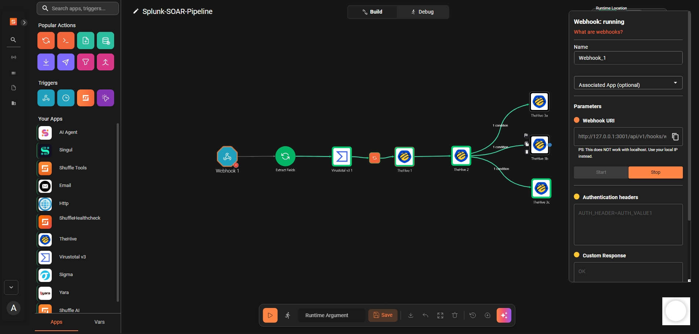

---

### Node 2 — Extract Fields (Shuffle Tools)

| Field | Value |
|-------|-------|
| Type | Shuffle Tools |
| Action | `repeat_back_to_me` |
| Name | `Extract_Fields` |
| Call | `- src_ip=$exec.result.src_ip \n- user=$exec.result.user \n- rule=$exec.search_name \n- host=$exec.result.host` |

Extracts `src_ip` from the Splunk alert payload for downstream use.
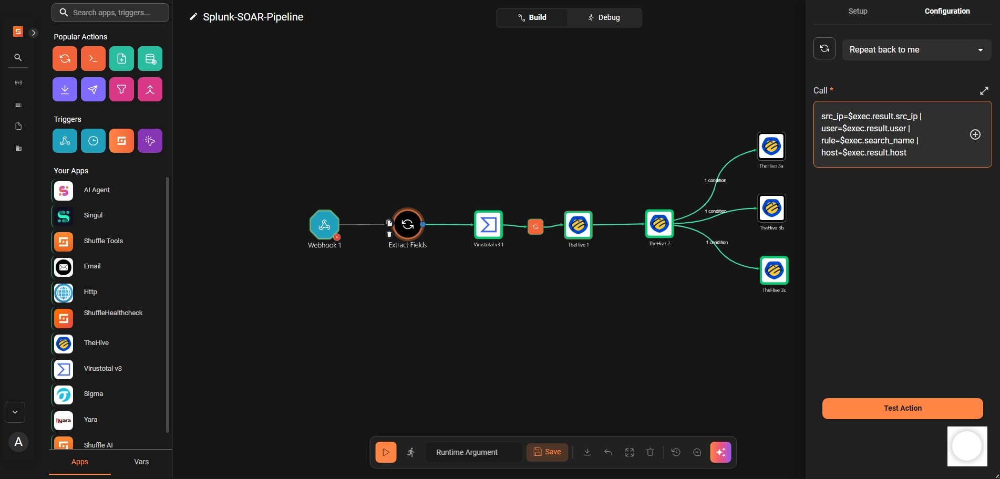

---

### Node 3 — VirusTotal (IP Reputation)

| Field | Value |
|-------|-------|
| Type | Virustotal v3 |
| Action | `get_ip_report` |
| Name | `Virustotal_1` |
| IP | `$exec.result.src_ip` |
| API Key | *(configured in Setup tab)* |

**Key output field used downstream:**
```
$virustotal.body.data.attributes.last_analysis_stats.malicious
```
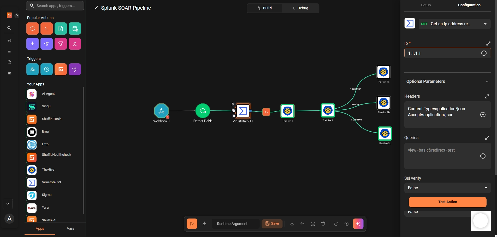

---
### Node 4 — BuildDesc (Shuffle Tools)

| Field | Value |
|-------|-------|
| Type | Shuffle Tools |
| Action | `repeat_back_to_me` |
| Name | `BuildDesc` |
| Call | `CyberShield system detected:\n- Source IP: $exec.result.src_ip\n- User: $exec.result.user\n- Host: $exec.result.host\n- Rule: $exec.search_name` |

**Key output field used downstream:**
```
$builddesc.#
```
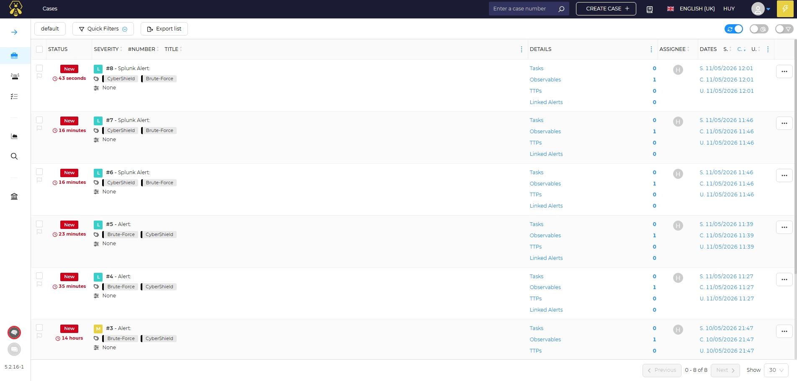

---


### Node 5 — TheHive_1 (Create Case)

| Field | Value |
|-------|-------|
| Type | TheHive 1.1.0 |
| Action | `post_create_case` |
| Name | `TheHive_1` |
| Auth | `Auth for TheHive` |
| URL | `http://172.18.0.1:9000` |

**Body:**
```json
{
  "title": "Splunk Alert: $exec.search_name",
  "description": "$builddesc.#",
  "severity": 2,
  "tags": ["CyberShield", "Brute-Force"],
  "tlp": 2,
  "status": "New",
  "type": "external"
}
```

**Key output field used downstream:**
```
$thehive_1.body._id
```

> Note: Docker gateway IP `172.18.0.1` is used instead of `10.0.0.8` so Shuffle containers can reach TheHive.
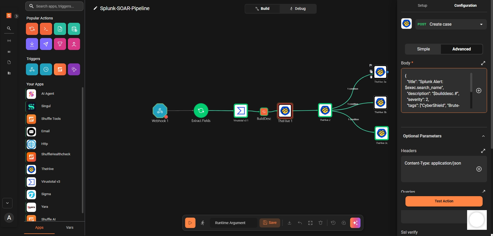

---

### Node 6 — TheHive_2 (Create Observable)

| Field | Value |
|-------|-------|
| Type | TheHive 1.1.0 |
| Action | `post_create_observable_in_case` |
| Name | `TheHive_2` |
| Auth | `Auth for TheHive` |
| CaseId | `$thehive_1.body._id` |

**Body:**
```json
{
  "data": "$exec.result.src_ip",
  "dataType": "ip"
}
```
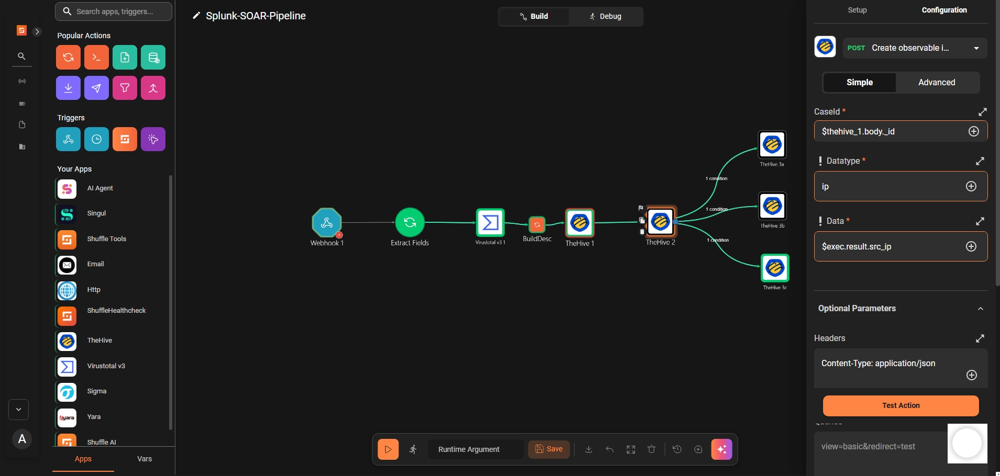

---

### Node 7a — TheHive_3a (Set Severity: High)

| Field | Value |
|-------|-------|
| Type | TheHive 1.1.0 |
| Action | `Update case` |
| Name | `TheHive_3a` |
| Auth | `Auth for TheHive` |
| IdOrName | `$thehive_1.body._id` |
| severity | `3` |

**Branch condition (on arrow from TheHive_2):**
```
$virustotal.body.data.attributes.last_analysis_stats.malicious > 5
```
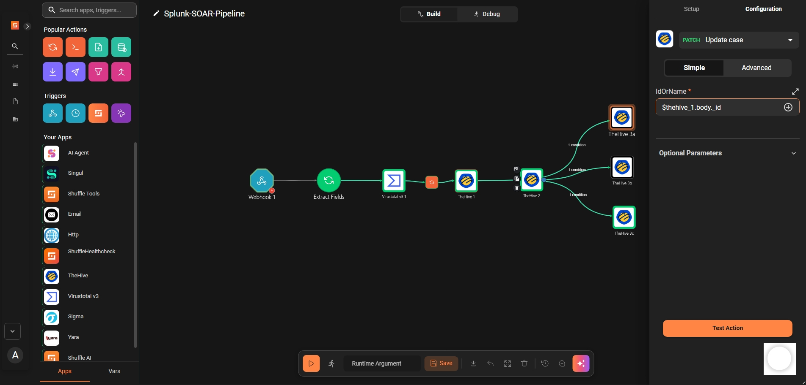
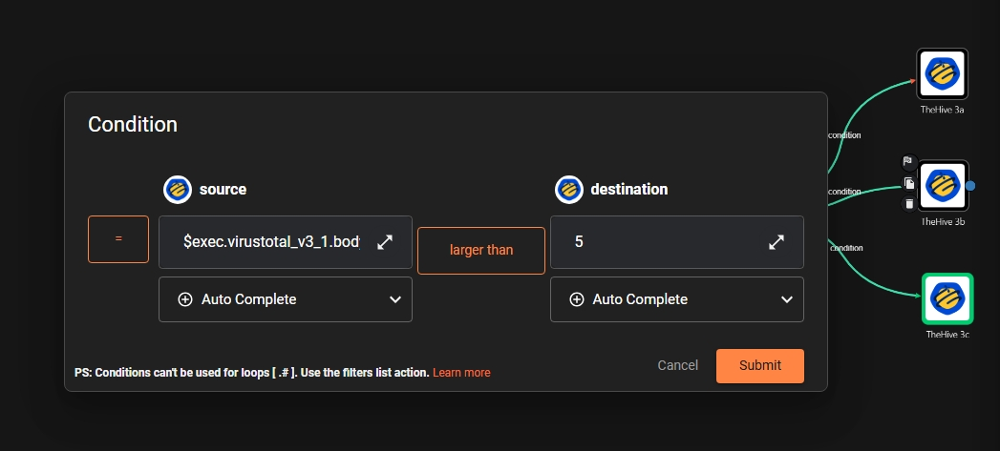

---

### Node 7b — TheHive_3b (Set Severity: Medium)

| Field | Value |
|-------|-------|
| Type | TheHive 1.1.0 |
| Action | `Update case` |
| Name | `TheHive_3b` |
| Auth | `Auth for TheHive` |
| IdOrName | `$thehive_1.body._id` |
| severity | `2` |

**Branch condition (on arrow from TheHive_2):**
```
$virustotal.body.data.attributes.last_analysis_stats.malicious > 2
```
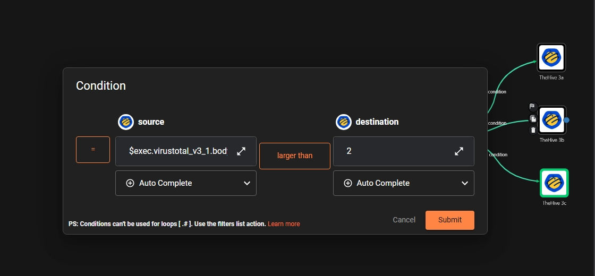

---

### Node 7c — TheHive_3c (Set Severity: Low)

| Field | Value |
|-------|-------|
| Type | TheHive 1.1.0 |
| Action | `Update case` |
| Name | `TheHive_3c` |
| Auth | `Auth for TheHive` |
| IdOrName | `$thehive_1.body._id` |
| severity | `1` |

**Branch condition:** None (default / else branch)
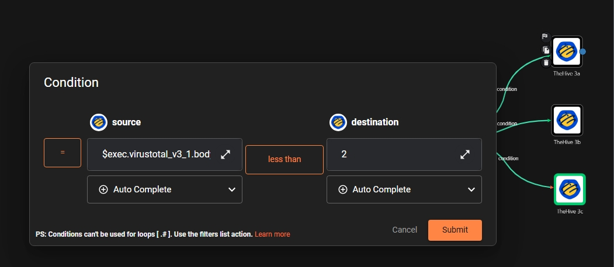

---

## Severity Mapping

| VirusTotal Malicious Score | Severity Level | TheHive Value |
|---------------------------|----------------|---------------|
| > 5                       | High           | 3             |
| > 2 and ≤ 5               | Medium         | 2             |
| ≤ 2                       | Low            | 1             |

---

## Authentication

| Service | Field | Value |
|---------|-------|-------|
| TheHive | URL | `http://172.18.0.1:9000` |
| TheHive | API Key | *(org user: `WFF3fP0RhjcRZW5NG1F16TMyREFZ1xRR`)* |
| VirusTotal | API Key | *86b879e3c6a024141e880a99db1e5dc38cc928088c563b34a756bdfb59dd3d2e* |

---

## Test Command

```bash
curl -X POST http://10.0.0.8:3001/api/v1/hooks/webhook_f6d4c46d-d498-41cb-92a4-acef3b174118 \
  -H "Content-Type: application/json" \
  -d '{
    "result": {
      "src_ip": "1.1.1.1",
      "user": "administrator",
      "count": "10",
      "host": "Windows10"
    },
    "search_name": "Brute Force Detection"
  }'
```
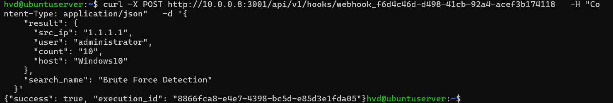

---

## Expected Results

| Node | Expected Status  |
|------|----------------  |
| Extract_Fields | success|
| Virustotal_1 | 200 OK   |
| BuildDesc | success     |
| TheHive_1 | 201 Created |
| TheHive_2 | 201 Created |
| TheHive_3a/3b/3c | 204 No Content (one of them) |

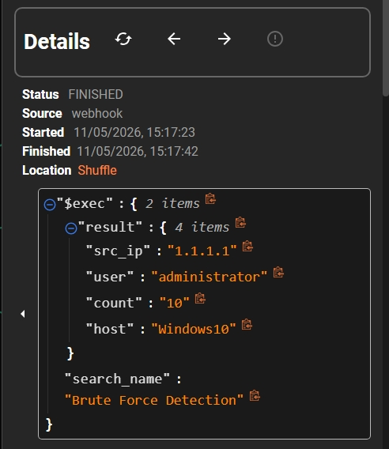
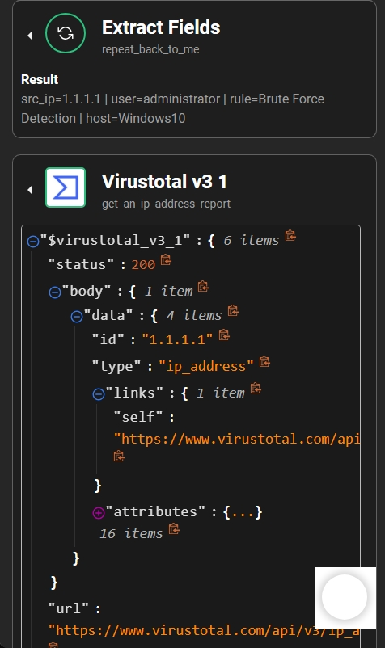
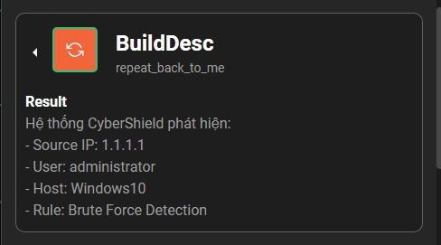
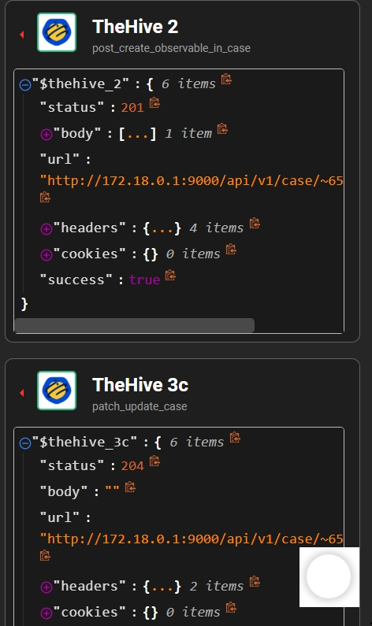
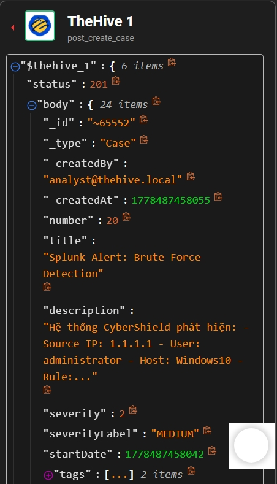

---

## Troubleshooting

| Issue | Fix |
|-------|-----|
| TheHive 400 Invalid JSON | Clear all `${variable}` placeholders from body, keep only needed fields |
| TheHive connection refused | Use `172.18.0.1` (Docker gateway) not `10.0.0.8` |
| TheHive 403 Forbidden | Use org user API key, not super admin |
| VirusTotal IP not parsed | Hardcode IP in node for testing, then use `$exec.result.src_ip` |
| TheHive_2 URL has `//observable` | TheHive_1 failed — fix TheHive_1 first |