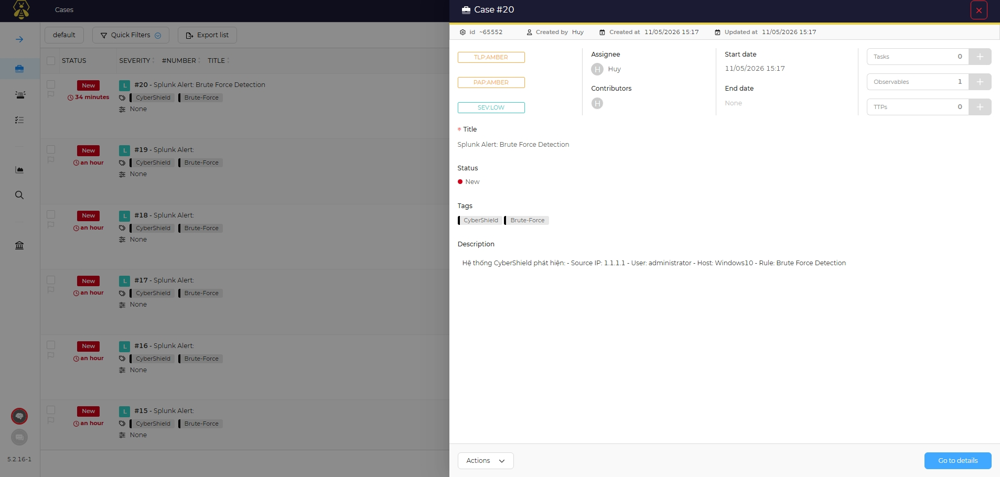
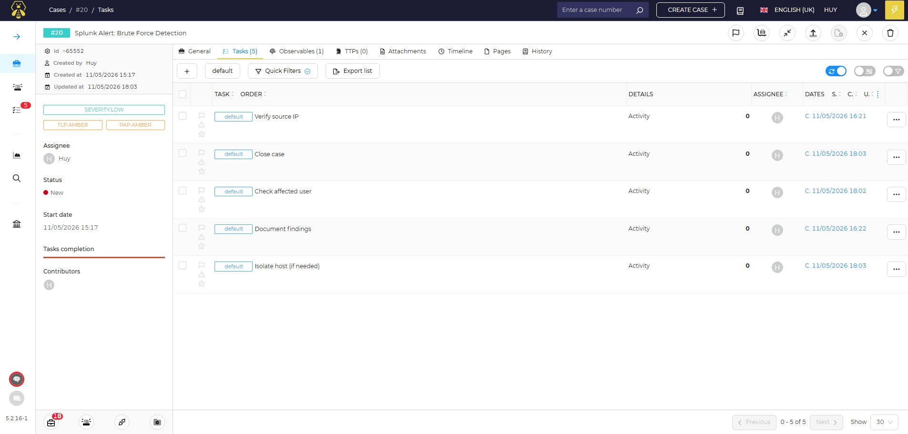
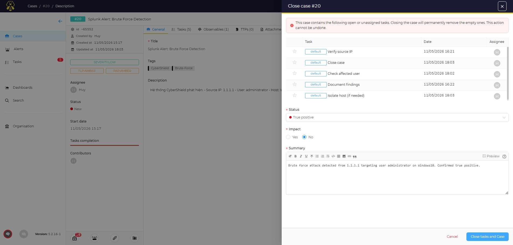
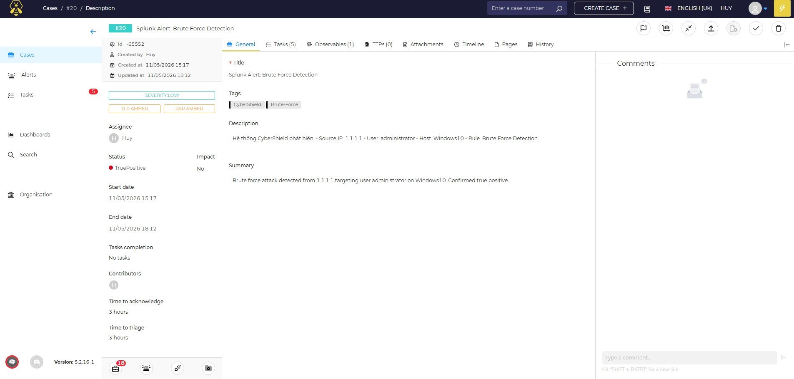

# Phase 5: TheHive Case Management & Investigation

## Overview

This phase covers managing security incidents in TheHive — investigating cases created automatically by Shuffle, assigning tasks, adding observables, and closing the incident lifecycle.

---

## 5.1 TheHive Concepts

| Term | Description |
|---|---|
| **Case** | An active security incident under investigation |
| **Observable** | IOC related to the incident: IP, domain, file hash, email |
| **Task** | Action item to complete during incident handling |
| **Alert** | Untriaged notification that can be promoted to a Case |
| **TLP** | Traffic Light Protocol – information sharing classification |

---

## 5.2 Review Auto-Created Cases

1. Login to TheHive: `http://127.0.0.1:9000`
2. Navigate to **Cases** → verify cases created automatically by Shuffle
3. Click on a case → review details:
   - Title: `Splunk Alert: Brute Force Detection`
   - Observable: `src_ip`
   - Description: alert context forwarded from Splunk



---

## 5.3 Add Tasks to a Case

Open case → **Tasks tab → Add Task**:

| Task | Description |
|---|---|
| Verify source IP | Check IP reputation and geolocation |
| Check affected user | Verify whether the account was compromised |
| Isolate host (if needed) | Block or isolate the affected endpoint |
| Document findings | Write investigation notes and timeline |
| Close case | Mark resolution and summarize outcome |



---

## 5.4 Analyze Observable with Cortex (Optional)

> Cortex is an analyzer engine that integrates with TheHive and can run automated analysis on observables.

If Cortex is installed:
1. Click on an observable → **Run analyzers**
2. Select: `VirusTotal_GetReport`, `AbuseIPDB`, `MaxMind_GeoIP`
3. View results directly inside TheHive

---

## 5.5 Case Investigation Workflow

```
[Case Created by Shuffle]
        ↓
[Analyst reviews case details]
        ↓
[Verify src_ip → VirusTotal / AbuseIPDB]
        ↓
[Check authentication logs for affected user]
        ↓
[Determine: True Positive or False Positive?]
        ↓
    [True Positive]                  [False Positive]
        ↓                                  ↓
[Escalate / Isolate host]            [Close case]
[Block IP on firewall]               [Tag as FalsePositive]
[Reset compromised account]
        ↓
[Document timeline in case notes]
        ↓
[Close case – Resolution: TruePositive]
```

---

## 5.6 Close a Case

After investigation is complete:

1. Open case → **Close case**
2. Select resolution:

| Resolution | When to use |
|---|---|
| `TruePositive` | Confirmed attack or malicious activity |
| `FalsePositive` | Alert triggered incorrectly |
| `Indeterminate` | Insufficient evidence to conclude |

3. Fill in summary notes describing findings and actions taken



---

## 5.7 End-to-End Pipeline Verification

Checklist to confirm the full pipeline is operational:

- [x] Splunk receives logs from Windows and Linux agents
- [x] Splunk alert rule triggers on brute-force detection
- [x] Webhook sends payload to Shuffle
- [x] Shuffle enriches source IP via VirusTotal
- [x] Shuffle automatically creates a case in TheHive
- [x] Case contains: title, description, observable, and correct severity
- [x] Analyst can assign tasks and investigate within TheHive
- [x] Case is closed with the appropriate resolution